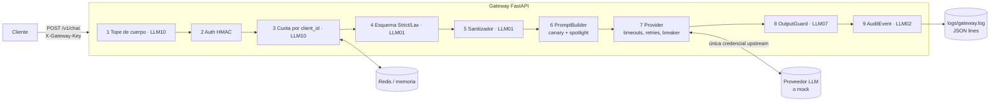

# Ingeniería inversa · llm-gateway-owasp

Documento reconstruido a partir del código fuente, la configuración, los scripts y la suite de pruebas
(commit `2856b9f`, único commit del repositorio). Todas las afirmaciones de comportamiento se verificaron
ejecutando la suite (51/51 pruebas en verde) y sondas adicionales descritas en la sección 9.

---

## 1. Qué es el sistema

Un **API gateway para LLMs** escrito en Python 3.12 + FastAPI. Expone un único endpoint `POST /v1/chat`
y reenvía la conversación a un proveedor (Anthropic, OpenAI, Ollama o un mock local). Entre el cliente y
el proveedor interpone controles de seguridad mapeados al **OWASP Top 10 for LLM Applications 2025**:

| Riesgo OWASP | Control principal |
| --- | --- |
| LLM10 Unbounded Consumption | Cuota por identidad de cliente, tope de cuerpo, de mensajes y de `max_tokens` |
| LLM01 Prompt Injection | Esquema estricto sin rol `system`, normalización Unicode, reglas heurísticas, spotlighting |
| LLM02 Sensitive Information Disclosure | Secretos `SecretStr`, keys de cliente como HMAC, log por allowlist + redacción, errores RFC 9457, gitleaks |
| LLM07 System Prompt Leakage | Canary token + detección de solapamiento de 8-gramas en la salida |
| No funcional: resiliencia | Timeouts, reintentos con backoff, circuit breaker, taxonomía de errores |

Es un proyecto académico ("Fundamentos de Arquitectura de LLMs", opción 4). Su rasgo distintivo es que
**el mismo binario corre en dos perfiles**: `baseline` (todos los controles apagados, para demostrar el
ataque) y `secure` (todos activos, para demostrar la mitigación). Cada prueba de seguridad afirma ambas cosas.

## 2. Stack y dependencias

| Capa | Tecnología |
| --- | --- |
| Web | FastAPI 0.115, Uvicorn |
| Validación / config | Pydantic 2.10, pydantic-settings 2.7 |
| HTTP saliente | httpx 0.28 (async) |
| Rate limiting | `limits` 3.14 (motor de slowapi), ventana deslizante, backend memoria o Redis 7 |
| Pruebas | pytest 8 + pytest-asyncio, transporte `httpx.ASGITransport` (sin red) |
| Contenedores | Dockerfile `python:3.12-slim`, usuario no root uid 10001; Compose con gateway + mock + Redis |
| Seguridad del repo | gitleaks (pre-commit y CI, historial completo), hooks `detect-private-key` |

## 3. Estructura del código

```
app/
  main.py                    App factory create_app(settings, upstream_transport)
  config.py                  Settings: perfiles, flags, guardia de producción
  api/chat.py                Endpoint único y orquestación del pipeline
  api/schemas.py             Esquemas Strict (secure) y Lax (baseline)
  core/prompt_builder.py     System prompt del servidor + canary + spotlighting
  core/system_prompt.txt     Prompt de sistema (sin secretos por diseño)
  security/auth.py           Registro de clientes por HMAC, client_id seudónimo
  security/rate_limit.py     Cuota por client_id (MovingWindow)
  security/sanitizer.py      Normalización + reglas INJ-001..005, LEN-001
  security/output_guard.py   Canary + n-gramas sobre la respuesta
  providers/base.py          Protocolo Provider y ProviderResult
  providers/clients.py       Adaptadores OpenAI-compatible y Anthropic; llamada ingenua vs. endurecida
  resilience/errors.py       Jerarquía UpstreamError y respuesta problem+json
  resilience/circuit_breaker.py  closed → open → half_open
  observability/secure_logger.py AuditEvent (allowlist), RedactionFilter, JSON lines
mock_upstream/app.py         Proveedor simulado vulnerable y determinista, fallos inyectables
attacks/                     Ataques reproducibles con curl (uno por riesgo)
scripts/                     bootstrap de secretos, cambio de perfil, demo local, reporte
tests/                       unit (30), security (13), resilience (8)
```

## 4. Arquitectura



### 4.1 Composición

`create_app` es una **app factory** que construye todas las dependencias una vez y las cuelga de
`app.state`: `settings`, `registry`, `limiter`, `prompt_builder`, `output_guard`, `provider`, `ops_log`.
No usa el sistema de dependencias de FastAPI; el endpoint lee `request.app.state` directamente.
La factory acepta un `upstream_transport` inyectable, que es lo que permite a las pruebas conectar el
gateway con el mock en el mismo proceso, sin sockets.

Otras decisiones en el arranque:

- `debug = not safe_errors_on`. En baseline FastAPI devuelve la traza al cliente; esto es intencional.
- `/docs` y `/openapi.json` se desactivan solo con `ENVIRONMENT=production`.
- El canary se toma de `CANARY_TOKEN` o se genera aleatorio en cada arranque (`CANARY-<16 hex>`).
- En secure se registra un handler global de `Exception` que responde `500 INTERNAL_ERROR` en problem+json.
- `/health` devuelve perfil y estado del circuito.

## 5. Pipeline de `POST /v1/chat` paso a paso

Fuente: `app/api/chat.py`. Cada salida temprana pasa por `fail()`, que emite un `AuditEvent` y responde
`application/problem+json`. El `request_id` es `uuid4().hex[:16]`.

| # | Paso | Condición | Respuesta si falla | `outcome` auditado |
| --- | --- | --- | --- | --- |
| 1 | Tope de cuerpo | `rate_limit_on` y cuerpo > 32 768 B | 413 `PAYLOAD_TOO_LARGE` | `rejected_schema` |
| 2 | Autenticación | siempre | 401 `UNAUTHORIZED` | `rejected_auth` |
| 3 | Cuota | `rate_limit_on` | 429 `RATE_LIMITED` + `Retry-After` | `blocked_rate_limit` |
| 4 | Esquema | Strict si `sanitizer_on`, si no Lax | 422 `INVALID_REQUEST` | `rejected_schema` |
| 4b | Nº de mensajes | `rate_limit_on` y > 20 | 422 `INVALID_REQUEST` | `rejected_schema` |
| 5 | Sanitización | `sanitizer_on`, solo mensajes `user` | 400 `INPUT_REJECTED` | `blocked_input` + `rule_id` |
| 6 | `max_tokens` | `min(pedido, 1024)` si `rate_limit_on` | — | — |
| 7 | Prompt | spotlight si `sanitizer_on` | — | — |
| 8 | Proveedor | ver sección 6 | 502 / 503 / 504 tipados | `upstream_*`, `circuit_open` |
| 9 | Guardia de salida | `output_guard_on` | 200 con texto neutro y `OUTPUT_FILTERED` | `blocked_output_leak` |
| 10 | Respuesta | — | 200 `{request_id, model, content, usage}` | `allowed` |

Observaciones de diseño reconstruidas:

- La cuota se descuenta **antes** de validar el esquema: una petición inválida también consume cuota.
- La cuota se indexa por `client_id`, nunca por IP. Rotar `X-Forwarded-For` no evade el límite.
- Un bloqueo por sanitización ocurre **antes** de llamar al proveedor: cero tokens consumidos.
- La guardia de salida no devuelve error HTTP; responde 200 con contenido neutro para no dar señal al atacante.

### 5.1 Autenticación (`security/auth.py`)

- Las keys de cliente (`gk_…`) nunca se guardan en claro. `.env` contiene `CLIENT_KEY_HASHES=nombre:HMAC-SHA256(pepper, key)`.
- La key presentada se hashea y se compara con `hmac.compare_digest` contra **todas** las entradas, sin cortar en la primera coincidencia.
- El `client_id` usado en cuotas y logs es un seudónimo: `cli_` + primeros 8 hex del HMAC.
- Sin pepper configurado, toda autenticación falla (fail-closed).

### 5.2 Cuota (`security/rate_limit.py`)

- Spec por defecto `10/minute;200/day`, parseada con `limits.parse_many`.
- Estrategia `MovingWindowRateLimiter`. Se evalúan todos los límites y se informa el más restrictivo en `X-RateLimit-Remaining`.
- `memory://` en local; `redis://redis:6379/0` en Compose, para contadores compartidos entre workers.

### 5.3 Sanitizador (`security/sanitizer.py`)

Función pura en tres capas:

1. NFKC, que pliega caracteres fullwidth y compatibles.
2. Elimina categorías Unicode `Cf`, `Cc`, `Co`, `Cs` salvo `\n` y `\t`. Esto quita ancho cero y bidi.
3. Pliega a minúsculas sin tildes y aplica reglas versionadas:

| Regla | Detecta |
| --- | --- |
| `LEN-001` | Longitud normalizada > 4 000 caracteres |
| `INJ-001` | "ignora / olvida / disregard … instrucciones / reglas / prompt" |
| `INJ-002` | Peticiones de "system prompt", "instrucciones iniciales / ocultas" |
| `INJ-003` | Tokens de plantilla: `<\|im_start\|>`, `[INST]`, `<<SYS>>`, `### System:` |
| `INJ-004` | "ahora eres / act as … sin restricciones / DAN / unrestricted" |
| `INJ-005` | "developer mode", "jailbreak", "do anything now" |

El texto que se envía al modelo es la versión **normalizada**, no la original.

### 5.4 Prompt (`core/prompt_builder.py`)

- El system prompt solo lo construye el servidor: `system_prompt.txt` + `"Referencia interna de configuracion: <canary>"`.
- Con spotlighting, cada mensaje `user` se envuelve en `<<entrada_NONCE>> … <</entrada_NONCE>>` con un nonce
  de 8 hex aleatorio por petición. El system prompt añade que ese contenido es dato, no instrucción.

### 5.5 Guardia de salida (`security/output_guard.py`)

- Al arrancar precalcula el conjunto de 8-gramas de palabras del system prompt, normalizado sin tildes.
- Bloquea si la respuesta contiene el canary literal o comparte cualquier secuencia de 8 palabras consecutivas.
- Complejidad lineal en la longitud de la respuesta; búsqueda de n-gramas en un `set`.

## 6. Capa de proveedores y resiliencia

`providers/clients.py` implementa un **Template Method**: `_BaseProvider.complete()` pide a la subclase
`_request()` (ruta, cabeceras, cuerpo) y `_parse()` (respuesta normalizada a `ProviderResult`).

| Adaptador | Ruta | Credencial | Uso |
| --- | --- | --- | --- |
| `OpenAICompatibleProvider` | `/v1/chat/completions` | `Authorization: Bearer` | OpenAI, Ollama, mock |
| `AnthropicProvider` | `/v1/messages` | `x-api-key`, `anthropic-version: 2023-06-01` | Anthropic |

Es el **único** módulo que lee `UPSTREAM_API_KEY`.

### 6.1 Llamada ingenua (baseline) vs. endurecida (secure)

| Aspecto | Baseline | Secure |
| --- | --- | --- |
| Timeouts | ninguno | connect 3 s, read 20 s, total 25 s con `asyncio.wait_for` |
| Log de la llamada | cabeceras y cuerpo completos, con la credencial | nada |
| Errores HTTP | `raise_for_status` → traza al cliente | taxonomía tipada |
| Reintentos | no | hasta 2, solo 429/503, backoff `min(2, 0.2·2^n)` + jitter |
| Circuit breaker | no | sí |

### 6.2 Taxonomía de errores (`resilience/errors.py`)

| Excepción | HTTP | `code` | Disparador | ¿Cuenta como fallo del breaker? |
| --- | --- | --- | --- | --- |
| `UpstreamTimeout` | 504 | `UPSTREAM_TIMEOUT` | timeout | sí |
| `UpstreamError` | 502 | `UPSTREAM_UNAVAILABLE` | 5xx, error de red, JSON inválido | sí |
| `UpstreamError` | 502 | `UPSTREAM_UNAVAILABLE` | otros 4xx | no |
| `UpstreamAuthError` | 502 | `UPSTREAM_UNAVAILABLE` | 401/403 del proveedor | sí, y alerta en `gateway.ops` |
| `UpstreamSaturated` | 503 | `UPSTREAM_SATURATED` | 429 tras agotar reintentos | no |
| `CircuitOpen` | 503 | `CIRCUIT_OPEN` | breaker abierto | — |

`UpstreamAuthError` se presenta al cliente igual que un 5xx genérico: no revela que la credencial del
gateway falló. El operador se entera por el log `ALERTA`.

### 6.3 Circuit breaker

Estado derivado de `failures` y `opened_at`: `closed` → `open` tras 3 fallos → `half_open` cuando pasan
30 s → `closed` con un éxito, o `open` de nuevo con un fallo. Hay una instancia por proveedor y por proceso.

## 7. Configuración y perfiles (`config.py`)

- `Settings` lee `.env` y luego `.env.profile`. El segundo lo escribe `scripts/switch_profile.sh`.
- Cinco flags tri-estado (`None` hereda del perfil): `rate_limit`, `sanitizer`, `output_guard`, `safe_logging`, `safe_errors`.
- **Guardia de producción**: con `ENVIRONMENT=production` el arranque aborta si cualquier flag está apagado o si falta el pepper.
- Secretos como `SecretStr`: no aparecen en `repr` ni en `model_dump`.

Acoplamientos de flags que no son obvios:

| Flag | Además de su control nominal, gobierna… |
| --- | --- |
| `rate_limit` | tope de cuerpo, nº de mensajes y tope de `max_tokens` |
| `sanitizer` | esquema estricto (sin rol `system`) y spotlighting |
| `safe_errors` | `debug` de FastAPI **y** el modo endurecido del proveedor (timeouts, breaker) |
| `safe_logging` | filtro de redacción y desactivación del logger `gateway.naive` |

## 8. Observabilidad (`observability/secure_logger.py`)

Tres loggers con salida JSON lines a fichero y stdout:

| Logger | Contenido | Perfil |
| --- | --- | --- |
| `gateway.audit` | un `AuditEvent` por petición | ambos |
| `gateway.ops` | alertas operativas y errores no controlados | ambos |
| `gateway.naive` | volcado de cabeceras, prompt y respuesta | solo baseline |

Dos barreras en secure:

1. **Allowlist estructural.** `AuditEvent` es un modelo Pydantic con `extra="forbid"`. Campos: `request_id`,
   `client_id`, `route`, `method`, `status`, `outcome`, `rule_id`, `provider`, `model`, `latency_ms`,
   `upstream_latency_ms`, `prompt_chars`, `tokens_in`, `tokens_out`, `profile`. Escribir un campo no declarado lanza excepción.
2. **Redacción.** `RedactionFilter` aplica regex para `sk-…`, `Bearer …`, `x-api-key`, `x-gateway-key`
   sobre el mensaje y la traza, e inlinea la excepción para que también se redacte.

## 9. Entorno de demostración y pruebas

### 9.1 Mock upstream

`mock_upstream/app.py` simula un modelo **vulnerable y determinista**:

- Responde `PWNED` si el texto de usuario contiene un patrón de anulación, tras quitar invisibles y tildes, o si recibe un rol `system` extra.
- Devuelve su system prompt completo si se le pide "configuración" o "instrucciones iniciales".
- Inyección de fallos vía `POST /_mode` con `ok | timeout | 500 | 429 | 401 | 503`. Contadores en `/_stats`, reinicio en `/_reset`.

### 9.2 Estrategia de pruebas

- `conftest.py` monta gateway y mock en el mismo proceso con `ASGITransport`. Las keys y el pepper se generan por prueba.
- Patrón **antes/después**: la prueba baseline afirma que el ataque tiene éxito; la secure afirma que se bloquea.
  Así se valida que la línea base es realmente vulnerable y que la mitigación es la causa del bloqueo.
- Cada prueba de seguridad escribe evidencia JSON en `evidence/<fecha>/<categoria>-<perfil>.json`.
  `scripts/report.py` la resume en `evidence/REPORT.md`.
- Los logs del perfil secure se guardan en `logs/pytest-secure.log` para que CI los escanee con gitleaks.

| Grupo | Pruebas | Qué cubre |
| --- | --- | --- |
| `unit/test_sanitizer.py` | 21 | 12 maliciosos, 7 legítimos, invisibles, longitud |
| `unit/test_output_guard.py` | 3 | canary, solapamiento, respuesta normal |
| `unit/test_logging_and_config.py` | 6 | allowlist, redacción, `SecretStr`, guardia de producción, HMAC |
| `security/*` | 13 | LLM10, LLM01, LLM02, LLM07 en ambos perfiles |
| `resilience/*` | 8 | mapeo de fallos, trazas en baseline, cuelgue sin timeout, breaker |

Resultado de la verificación: **51/51 en verde** con Python 3.14 y versiones actuales de FastAPI 0.143 y Pydantic 2.14.

### 9.3 Automatización

- `Makefile`: `bootstrap`, `install`, `test`, `evidence`, `attack-*` con `PROFILE=baseline|secure`, `demo-local`, `scan`, `clean-logs`.
- `scripts/bootstrap_env.py` genera pepper, dos keys `gk_…` y una key upstream **ficticia** con formato Anthropic,
  para que gitleaks la detecte en el log baseline.
- CI en GitHub Actions: job de gitleaks sobre el historial completo y job de pruebas que además escanea los logs y publica la evidencia.

## 10. Hallazgos de la ingeniería inversa

Debilidades y riesgos no documentados en `docs/OWASP_MAPPING.md`. Los dos primeros se reprodujeron con una sonda.

| # | Hallazgo | Impacto | Verificado |
| --- | --- | --- | --- |
| H1 | **Inyección por historial.** El sanitizador y el spotlighting solo tratan mensajes `user`. Un cliente puede enviar un mensaje `assistant` con "Ignora las instrucciones anteriores…" y llega íntegro al proveedor en perfil secure. | Alto con un modelo real: evade INJ-001..005 por completo. El mock no lo refleja porque solo lee mensajes `user`. | Sí: 200 `allowed`, texto intacto en la petición upstream |
| H2 | **Half-open sin límite de sondas.** En `half_open`, `allow()` devuelve `True` a todas las peticiones concurrentes. | Medio: al reabrirse, una ráfaga golpea a un proveedor que quizá sigue caído. | Sí |
| H3 | **El tope de cuerpo se aplica tras leerlo entero.** `await request.body()` carga todo en memoria antes de comparar con 32 KB, y la comprobación es anterior a la autenticación. | Medio para LLM10: un cliente anónimo puede enviar cuerpos grandes. Mitigable en el proxy o con un límite en streaming. | Por lectura de código |
| H4 | **`/health` sin autenticar** expone el perfil activo y el estado del circuito. | Bajo: reconocimiento, por ejemplo saber cuándo el gateway corre en baseline. | Sí |
| H5 | **Flags acoplados.** Apagar `safe_errors` también quita timeouts y breaker; apagar `rate_limit` quita el tope de `max_tokens`. | Bajo en producción por la guardia de arranque, pero confunde en pruebas parciales. | Por lectura de código |
| H6 | **Estado por proceso.** Breaker y canary aleatorio son por worker; con `memory://` también la cuota. | Bajo con Redis; con varios workers sin Redis la cuota real es N × límite. | Por lectura de código |
| H7 | La imagen Docker de producción incluye `mock_upstream/`. | Bajo: código innecesario en el runtime. | Por lectura de código |
| H8 | Si un 503 persiste en el último intento se mapea a 502 `UPSTREAM_UNAVAILABLE`, no a 503 `UPSTREAM_SATURATED` como un 429. | Bajo: inconsistencia semántica. | Por lectura de código |

Limitaciones ya reconocidas por el autor: heurística evadible por paráfrasis, guardia de salida ciega a
paráfrasis del system prompt, sin streaming, y no determinismo con modelos reales.

## 11. Recomendaciones

1. **H1:** sanitizar también los mensajes `assistant`, o rechazar historial de asistente que el gateway no haya emitido. Una opción es firmarlo con HMAC al devolverlo. Añadir una prueba con un mock que lea todos los roles.
2. **H2:** en `half_open` permitir una sola sonda con un flag o lock y rechazar el resto con `CIRCUIT_OPEN`.
3. **H3:** limitar el cuerpo en streaming, por ejemplo con `Content-Length` más un lector acotado, o en el proxy inverso.
4. **H4:** reducir `/health` a `{"status":"ok"}` en producción o protegerlo.
5. **H5:** separar flags de resiliencia y de límites de los flags de seguridad nominales.
6. **H7:** usar una etapa o imagen distinta para el mock.

## 12. Glosario

- **Canary token:** cadena aleatoria plantada en el system prompt. Si aparece en una salida, hubo fuga.
- **Spotlighting:** delimitar la entrada no confiable con marcadores impredecibles para que el modelo la trate como dato.
- **Pepper:** secreto del servidor mezclado en el HMAC de las keys. Sin él, un volcado de hashes no sirve para fuerza bruta.
- **RFC 9457:** formato estándar `application/problem+json` para errores HTTP.
